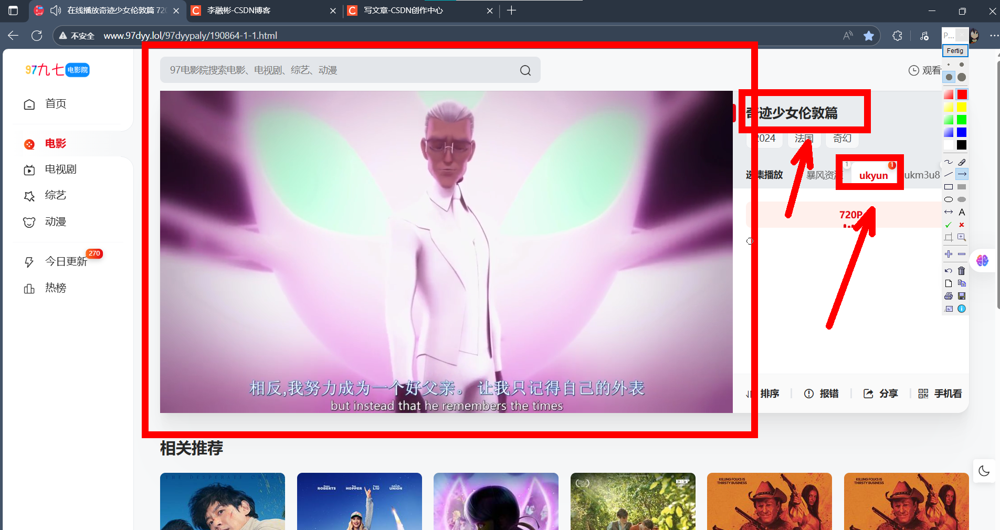
直接f12分析，发现他的资源是在iframe的，并且我们要爬取的是一个m3u8的文件
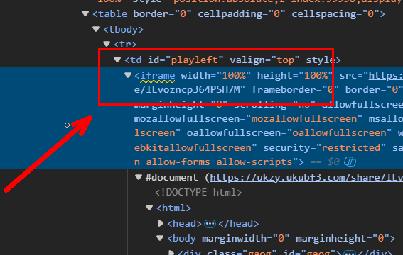
并且复制他的iframe标签，在Ctrl+u中搜索，也是没有的，这是个js加载的，一般获取这种动态加载的可以使用Selenium打开浏览器等待页面加载完成后，在进入iframe获取src标签的网址内容。src网址直接打开是这样的，一个全屏的视频播放。这里我就不搞那么麻烦了，直接复制然后发送请求使用
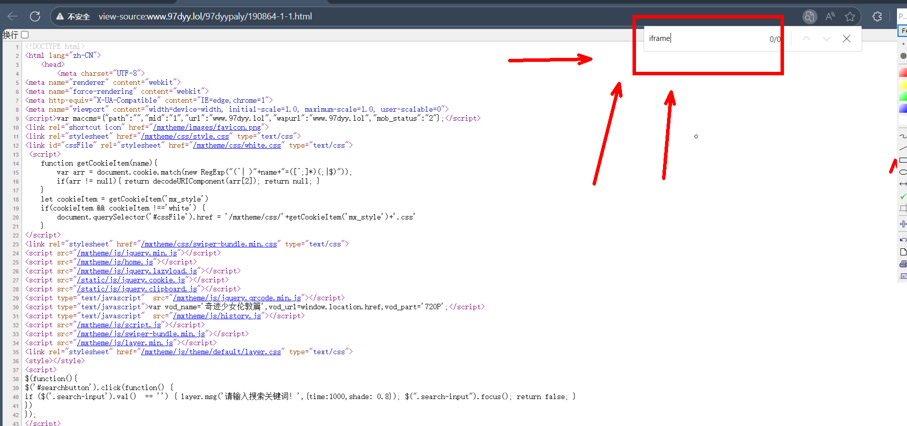
这个标签里边的链接就是全屏播放，如下：
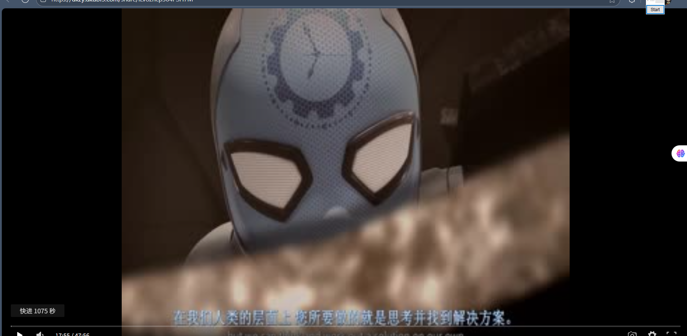
对这个该页进行发送请求返回结果：
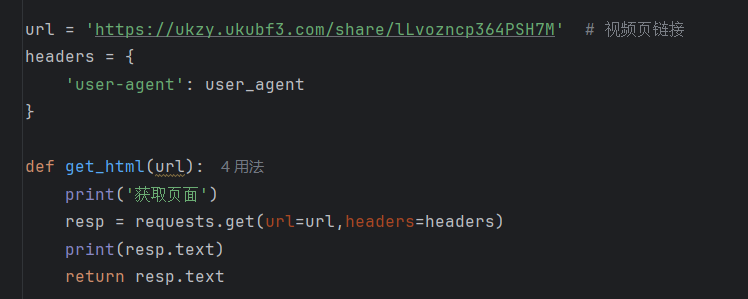

在返回的结果中，这个url对应的就是相应的m3u8文件，我们在浏览器播放视频时抓包也能看到，这个地址是包含相应的电影资源的
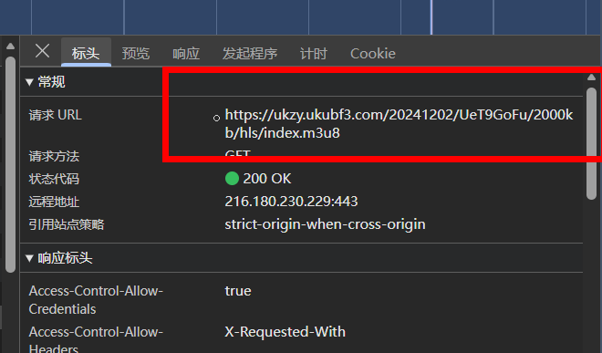
我们使用正则把该网址提取出来，并且保存一下
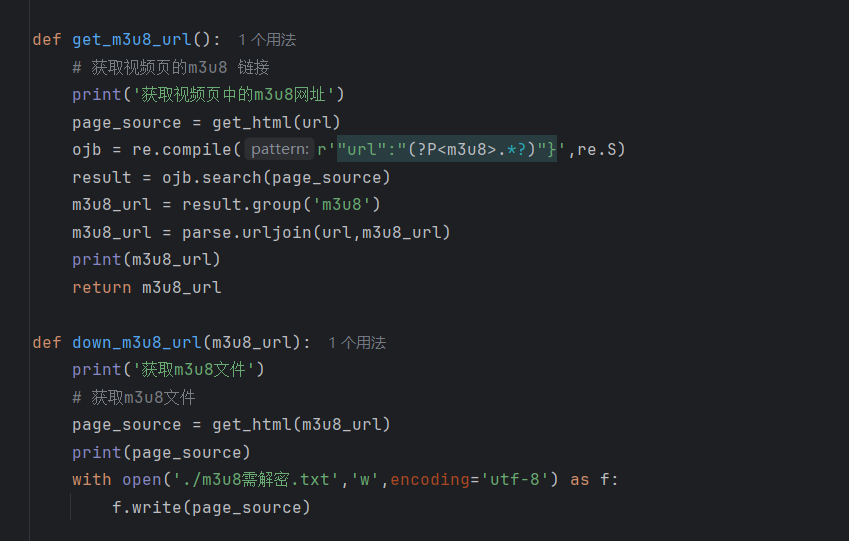
得到以下结果：

这也对应着网页监控中的相应内容
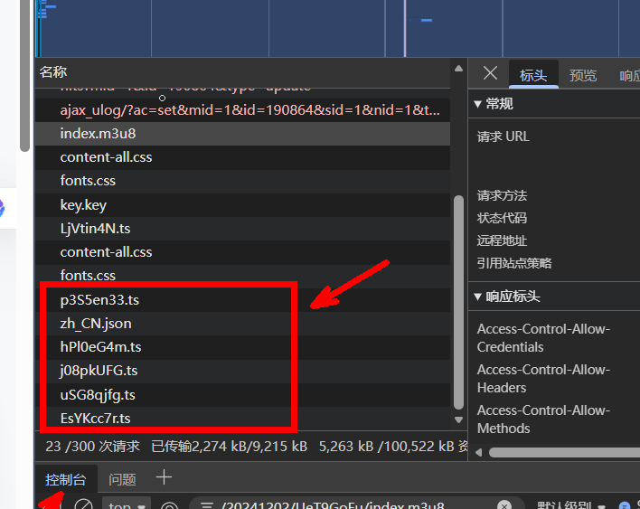
这些ts文件就是这部要爬取的dianying切割的一小部分。在m3u8文件中我们可以知道，每个ts文件视频长度最多不超过6s，而且这些ts是经过AES对称加密的，通过观察到的METHOD=AES-128，确认16字节，以及浏览器看到的秘钥网址中的hls字样，能得出该加密模式为CBD模式，别去key的地址也在m3u8文件里
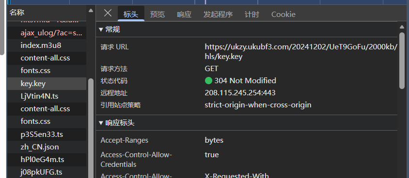
在此之前，我们对获取的m3u8的文件中已经得到的ts文件地址进行访问，把这些文件给下载下来。一部电影少说也有上千的ts文件组成，所有我们使用异步对这些ts文件爬取。
```python
async def download_one(session,url_ts):  # 使用异步方法去下载，毕竟量太大了
    for i in range(4):  # 重试4次
        try:
            file_name = url_ts.split('/')[-1]
            async with semaphore: #
                async with session.get(url_ts,timeout=30) as resp: # 30s都没有就算了
                    content = await resp.content.read()
                    async with aiofiles.open(f"./电影_源_加密/{file_name}",mode="wb") as f:
                        await f.write(content)
            print(url_ts,'下载成功')
            break
        except:
            print('下载失败',url_ts)
            await asyncio.sleep((i+1)*2) # 失败了就休息一下再爬

async def download_ts_all(session):
    tasks = []
    with open('./m3u8需解密.txt','r',encoding='utf-8') as f:
        for line in f:
            if line.startswith('#'):
                continue
            line = parse.urljoin(url,line)
            task = asyncio.create_task(download_one(session,line))
            tasks.append(task)
    await asyncio.wait(tasks) # 把任务挂起，去等待执行
```
得到以下结果：
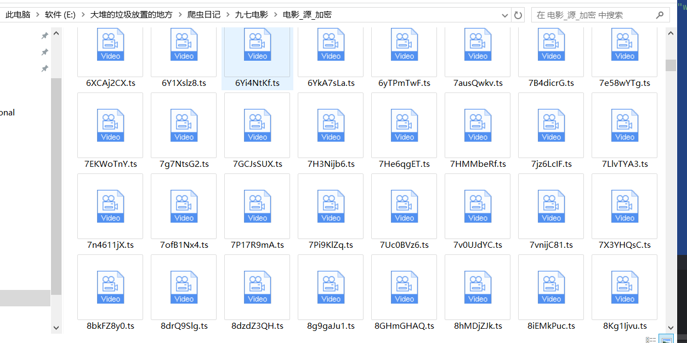
这些爬取完成的ts文件，因为AES加密，所有并不能查看这些视频。
对m3u8文件中，key的地址进行访问，并转成字节
```python
def get_key():  # 获取key
    obj = re.compile(r'URI="(.*?)"',re.S)

    with open('m3u8需解密.txt','r',encoding='utf-8') as f:
        result = obj.findall(f.read())[0]
        f.close()
    url_key=parse.urljoin(url,result)
    print(url_key)
    key_str = get_html(url_key)
    print(key_str.encode('utf-8'))
```

输出：
b'e3dec185bc8cbceb'

这时候，我们就拿着这个key，去打开那些ts文件，进行解密后再保存起来，因为数量很多，依旧使用异步，如下：
```python
async def dec_one(filename,key):  # 解密
    print(f"{filename}：开始解密")
    # 加密解密对象开始创建，偏移量0，模式MODE_CBC
    aes = AES.new(key=key,IV=b'0000000000000000',mode=AES.MODE_CBC)
    async with aiofiles.open(f'./电影_源_加密/{filename}',mode='rb') as f1, \
            aiofiles.open(f'./电影_源_解密后/{filename}', mode='wb') as f2:
        # 解密后直接保存到另一个文件夹
        content = await  f1.read()
        bc = aes.decrypt(content) # 解密
        await f2.write(bc)
        print(f"{filename}：解密完成")
```
这时候我们在去看看这些ts文件，可以发现，这是时长只有几秒的ts文件是能够播放的，解密完成，随便点一个，也是能播放的

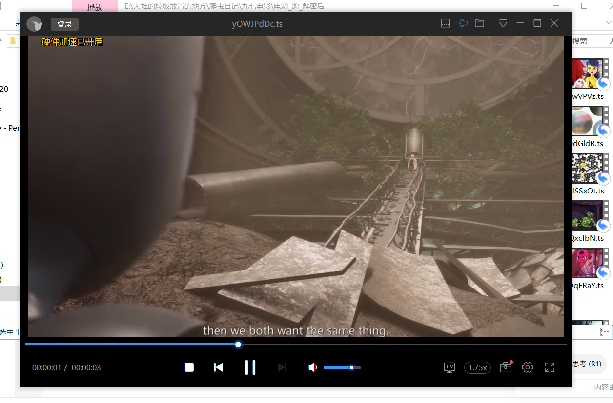
然后就是需要把这些视频合并在一起。因为是使用异步爬取的视频，所有顺序也是乱糟糟的，我们依旧读取m3u8文件，根据文件里的ts顺序来整理一下，写到一个txt文件里，然后再用ffmpeg根据txt文件里的顺序进行一次性合并
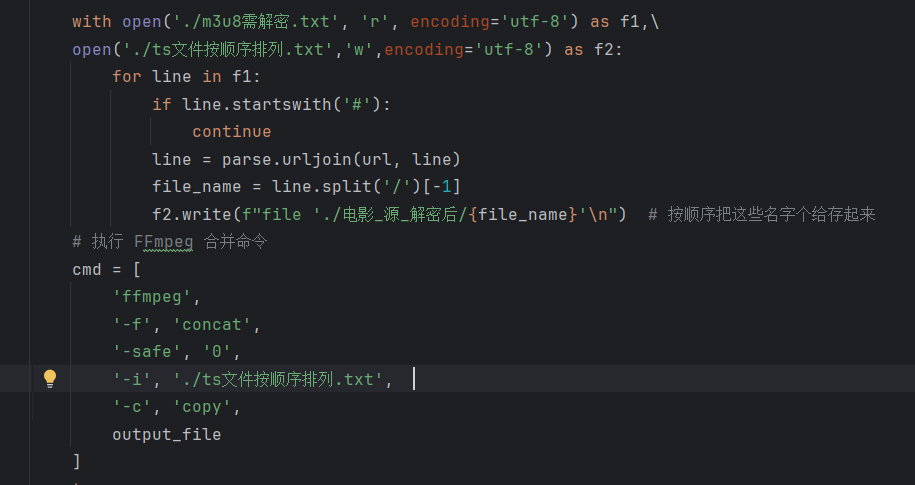

最后也是成功的将这上千个ts文件合并成一个mp4文件了


