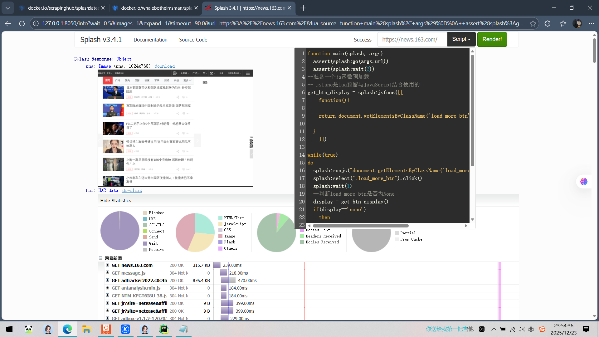
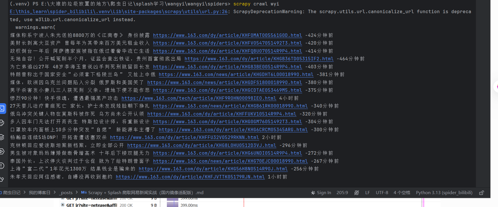

## 项目前言

项目由我搭配ai使用完成。由于网络环境限制，无法直接拉取官方 `scrapinghub/splash` 镜像，因此通过 **国内镜像源完成 Splash 环境搭建**，全程自主解决镜像查找、容器启动、版本兼容问题，完整覆盖「环境搭建 → 爬虫开发 → 问题排查 → 数据爬取」全流程，体现实战落地与问题解决能力。
项目地址：https://github.com/slli123/spiders/tree/main/Scrapy%20_splash%20%E7%88%AC%E5%8F%96%E7%BD%91%E6%98%93%E6%96%B0%E9%97%BB
<!more>
**技术栈**：Scrapy 2 + Splash（国内镜像）+ Docker + XPath

## 一、 环境搭建（国内镜像适配）
    
### 1. 核心痛点：官方镜像拉取失败

直接执行 `docker pull scrapinghub/splash` 会因网络问题超时，无法完成环境搭建，我尝试着使用VPN，阿里云等方法都不行。

### 2. 解决方案：国内镜像源查找与部署

最后也是在网上找到了国内有的docker镜像，也是折腾了好几下，链接如下：

```bash
# 该版本为3.5，实际体验下来splash效果奇差，不知道是适配问题还是什么，不仅打开地址缓慢，网页渲染也不行，说不定也是我的电脑问题
https://docker.aityp.com/image/docker.io/scrapinghub/splash:latest
# 于是我又找了版本3.4的，这次总算能正常使用了，没有太多幺蛾子
https://docker.aityp.com/image/docker.io/whalebothelmsman/splash:latest
```

```bash

# 1. 拉取国内 Splash 镜像，这是华为云的
docker pull swr.cn-north-4.myhuaweicloud.com/ddn-k8s/docker.io/whalebothelmsman/splash:latest

# 2. 为镜像重命名（与官方镜像名一致
sudo docker tag swr.cn-north-4.myhuaweicloud.com/ddn-k8s/docker.io/whalebothelmsman/splash:latest scrapinghub/splash

# 3. 启动容器，映射 8050 端口
docker run -d -p 8050:8050 scrapinghub/splash
```

### 3. 环境验证
在Linux完成docker安装，并成功拉取部署了splash
成功部署完成splash后，在浏览器访问`http://127.0.0.1:8050`，能看到 Splash 的交互式测试页面
，
环境搭建成功。

>  
> 
> 

## 二、 项目核心难点与解决方案

实战中遇到的 6 类关键问题，结合日志分析与官方文档，形成针对性解决方案，具体如下：

|遇到的问题|报错信息/现象|解决方案|核心能力体现|
|---|---|---|---|
|国内镜像拉取与启动|官方镜像拉取超时、容器启动失败|检索国内镜像源，完成镜像拉取、重命名、容器后台启动|信息检索、环境适配|
|OffsiteMiddleware 拦截请求|日志提示：Filtered offsite request to '127.0.0.1'|在 settings.py 中禁用 OffsiteMiddleware 中间件|Scrapy 中间件原理、日志分析|
|Splash 响应解析错误|AttributeError: 'SplashJsonResponse' object has no attribute 'json'|放弃 response.json()，直接用 response.data 获取解析后数据|框架源码细节、报错定位|
|Lua 脚本崩溃无响应|Splash 未返回 HTML、爬虫卡住|在 JS 函数中添加空值判断，按钮不存在时返回 'none' 终止循环|前端 JS 基础、脚本容错设计|
|XPath 匹配不到数据|解析结果为空、无数据输出|放弃严格 class 匹配，改用 contains() 模糊匹配页面元素|页面结构分析、XPath 灵活运用|
|Scrapy 版本弃用警告|canonicalize_url / _get_slot_key() 警告干扰日志|在配置文件中过滤 ScrapyDeprecationWarning 警告|版本兼容处理、配置优化|
## 三、 核心代码实现

### 1. 爬虫核心代码（wyi.py）

```python

import scrapy
from scrapy_splash.request import SplashRequest
from scrapy import Selector

# Lua 脚本：实现页面动态加载（滚动+点击加载更多）
lua_source = """
function main(splash, args)
  -- 1. 伪装浏览器 User-Agent，降低反爬概率
  splash:set_user_agent("Mozilla/5.0 (Windows NT 10.0; Win64; x64) AppleWebKit/537.36 (KHTML, like Gecko) Chrome/120.0.0.0 Safari/537.36")
  
  -- 2. 访问目标页面，等待 2 秒确保初始加载完成
  assert(splash:go(args.url))
  assert(splash:wait(2))

  -- 3. 定义 JS 函数：获取「加载更多」按钮状态（添加空值判断）
  get_btn_display = splash:jsfunc([[
    function(){
      var btn = document.getElementsByClassName('load_more_btn')[0];
      return btn ? btn.style.display : 'none';  // 按钮不存在时返回 'none'
    }
  ]])

  -- 4. 循环点击加载更多（按钮存在时执行）
  local btn = splash:select(".load_more_btn")
  if btn then
    while(true)
    do
      -- 滚动到按钮位置，确保可点击
      splash:runjs("document.getElementsByClassName('load_more_btn')[0].scrollIntoView(true)")
      btn:click()
      splash:wait(1)  // 等待加载完成
      
      -- 按钮隐藏则终止循环
      display = get_btn_display()
      if(display=='none') then
        break
      end
    end
  end

  -- 5. 返回渲染后的完整 HTML
  return {
    html = splash:html()
  }
end
"""

class WyiSpider(scrapy.Spider):
    name = "wyi"  # 爬虫名称（执行时使用）
    allowed_domains = ["163.com"]  # 允许爬取的域名
    start_urls = ["https://news.163.com/"]  # 起始爬取地址

    # 
    async def start(self):
        yield SplashRequest(
            url=self.start_urls[0],
            callback=self.parse,  # 响应处理函数
            endpoint="execute",  # 指定执行 Lua 脚本
            args={
                "lua_source": lua_source,  # 传入 Lua 脚本
                "url": self.start_urls[0]  # 传入目标 URL 给脚本
            }
        )

    # 响应解析函数：提取新闻核心信息
    def parse(self, response):
        # 关键：SplashJsonResponse 直接通过 response.data 获取解析后的数据
        result = response.data
        html_content = result['html']
        
        # 可选：保存渲染后的 HTML 到本地，用于调试页面结构
        with open("splash_news163.html", "w", encoding="utf-8") as f:
            f.write(html_content)

        # 将 HTML 字符串转为 Selector 对象，用于 XPath 解析
        selector = Selector(text=html_content)
        
        # 宽松匹配新闻列表项（避免页面结构变化导致匹配失效）
        for content in selector.xpath('//div[contains(@class, "news_article")]'):
            # 提取新闻标题、链接、发布时间
            item = {}
            item["title"] = content.xpath('.//h3/a/text()').extract_first()  # 标题
            item["url"] = content.xpath('.//h3/a/@href').extract_first()     # 详情链接
            item["publish_time"] = content.xpath('.//span[contains(@class, "time")]/text()').extract_first()  # 发布时间
            
            yield item  # 输出数据
"""
```

### 2. 关键配置文件（settings.py）

仅保留核心配置（其余默认配置可注释），重点解决中间件拦截、镜像适配、日志优化问题：

```python

# 1. 爬虫伪装配置（降低被反爬概率）
USER_AGENT = "Mozilla/5.0 (Windows NT 10.0; Win64; x64) AppleWebKit/537.36 (KHTML, like Gecko) Chrome/120.0.0.0 Safari/537.36"
ROBOTSTXT_OBEY = False  # 绕过 robots 协议限制（必要时开启）

# 2. Splash 核心配置（国内镜像环境通用）
SPLASH_URL = "http://127.0.0.1:8050/"  # 本地 Splash 服务地址（与容器映射端口一致）

# 3. 下载器中间件配置：禁用 OffsiteMiddleware 解决请求拦截问题
DOWNLOADER_MIDDLEWARES = {
    "scrapy_splash.SplashCookiesMiddleware": 723,
    "scrapy_splash.SplashMiddleware": 725,
    "scrapy.downloadermiddlewares.httpcompression.HttpCompressionMiddleware": 810,
    "scrapy.downloadermiddlewares.offsite.OffsiteMiddleware": None,  # 关键：禁用跨站请求拦截
}

# 4. Splash 去重与缓存配置（避免重复请求，提升效率）
DUPEFILTER_CLASS = "scrapy_splash.SplashAwareDupeFilter"
HTTPCACHE_STORAGE = "scrapy_splash.SplashAwareFSCacheStorage"

```

## 四、 项目运行步骤

1. **启动 Splash 容器**：
    sudo docker run -d -p 8050:8050 scrapinghub/splash
    在浏览器中执行lua


2. **执行爬虫**：进入项目根目录，在终端执行：
       `scrapy crawl wyi`


## 五、 项目总结与延伸

### 1. 项目核心

- 环境适配：自主利用ai完成项目，从环境适配到代码排错等；

- 全流程排错：覆盖从环境搭建到数据解析的 6 类实战问题，形成可复用的解决方案；

- 代码健壮性：Lua 脚本添加容错判断、XPath 采用模糊匹配，提升爬虫稳定性，适配页面结构变化。

### 2. 延伸优化方向

- 增量爬取：基于新闻发布时间，实现定时增量爬取（结合 APScheduler），避免重复爬取历史数据；

- 分布式爬取：集成 Scrapy-Redis 实现分布式部署，提升大规模数据爬取效率；

- 数据可视化：使用 Pandas + Matplotlib 对新闻发布时间、分类进行统计分析，生成可视化图表；

- 反爬进阶：添加 IP 代理池、随机请求头、Cookie 池，应对更严格的网站反爬策略。

### 3. 实战感悟
其实这次爬虫遇到了很多问题，起初也是跟着网上去部署splash，本来也是在Linux中几行命令的事情，愣是在网上寻找国内相关的镜像上花费了大量时间，然后就是爬取网页时，利用splash进行js渲染，其中需要到在f12的控制台上使用JavaScript检索具体的节点标签，然后再在splash的浏览器界面中的lua添加进去，其中也没少问ai，有时候总感觉ai什么都能解决，但问题的发现和实际应用起来还得靠人去一步步检索试错；使用splash简单的渲染js加载的网页后，再使用scrapy解析返回得到的html，这有使用到了srapy_splash，在完成相关的setting的配置后，也没有完成得到需要的输出结果，折腾一番最后也是拿着debug日志输出找ai，才发现是Scrapy的OffsiteMiddleware把SplashRequest当成了跨站请求，直接过滤掉了，原来的allowed_domains = ["163.com"]是只允许爬取 163.com 域名但 SplashRequest 是通过 127.0.0.1:8050 这个地址发送的，OffsiteMiddleware 误以为要爬取 127.0.0.1，就拦截了请求，这我也是靠ai才解决成功输出想要的结果
#### 或许爬虫不在于写代码，而是排错解决问题吧
> 
