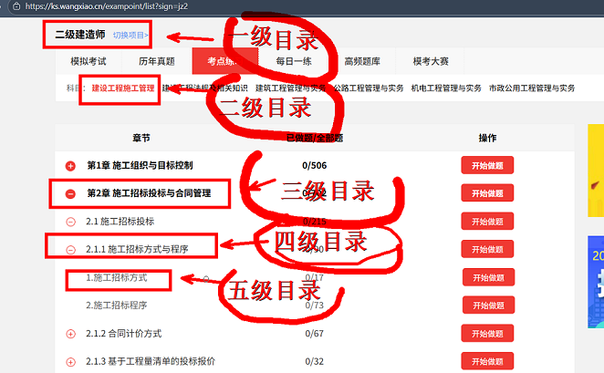
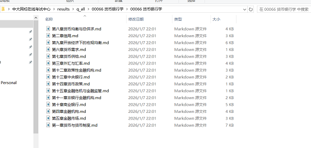
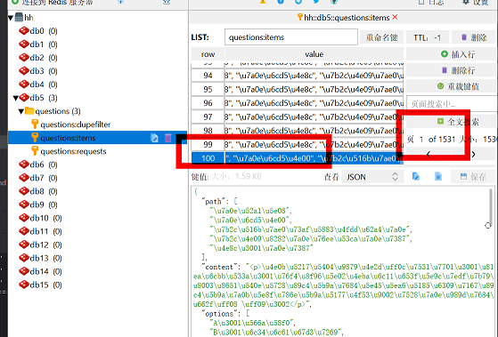
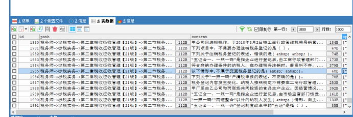
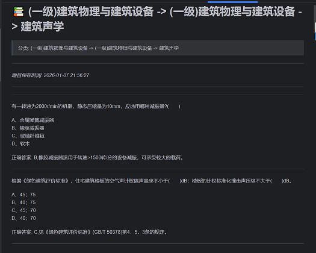

## 项目简介
### 项目地址：https://github.com/slli123/spiders/tree/main/scrapy_redis%E4%B8%AD%E5%A4%A7%E7%BD%91%E6%A0%A1
该项目旨在爬取**中大网校**的题库数据。题库数据呈树形结构，且需要用户登录才能访问。项目的关键技术包括：
- **Selenium**：用于自动化登录，处理验证码，获取并保存Cookie。
- **Scrapy-Redis**：分布式爬虫框架，用于高效抓取数以万计的题目数据。
- **MySQL**：存储清洗后的题库数据。
- **Redis**：缓存爬取过程中的数据，解决高并发访问的瓶颈。
- **异步编程**：用于在本地存储时避免并发冲突，确保高效写入和图片下载。
<!-- more -->
## 技术栈
- **项目架构**：项目模块化、解耦设计，实现高效爬虫，可根据需求灵活使用、拓展
- **Python**：主语言，使用 Scrapy, Selenium, Redis, MySQL 等库。
- **Selenium**：自动化网页操作，登录处理与验证码识别。
- **Scrapy-Redis**：分布式爬虫框架，支持高并发、断点续爬。
- **MySQL**：用于存储清洗后的题库数据，支持数据的持久化与查询。
- **Redis**：缓存爬虫过程中数据，支持分布式爬取，提高爬虫效率。

## 项目结构

1. **数据来源**：  
   网页数据呈树形结构，需用户登录后通过解析多级分类获取最终题目。每道题目包含题目内容、选项、答案与解析。
   如图所示：
2. **爬虫流程**：
   - **自动化登录**：使用Selenium处理验证码并获取登录所需的Cookie。
   - **分布式爬取**：利用Scrapy-Redis将数据分布式抓取，采用队列管理请求，保证按层级优先抓取最内层的题目。
   - **数据缓存**：爬取的数据暂存于Redis，并通过异步方式从Redis中提取数据进行清洗与存储。

3. **数据存储与清洗**：
   - **MySQL存储**：将清洗后的数据存入MySQL数据库，确保数据的可靠存储与查询。
   - 如图：
   - **本地MD存储**：通过异步方法将题目数据保存为MD文件，同时处理题目中的图片，确保图片链接替换为本地路径。
   - 如图为md文件存储目录结构：
   
4. **挑战与解决方案**：
   - **验证码识别**：调用超级鹰打码平台的API，成功自动识别并登录。
   - **队列与优先级管理**：为解决数据层级抓取问题，在Scrapy-Redis中设置优先级，避免低层数据被过滤或延迟爬取。
   - **大数据量存储**：使用Redis缓存中间数据，避免频繁的I/O操作，确保系统资源高效使用。
   - **并发写入**：通过任务队列机制避免多次并发写入同一文件，确保数据一致性。

## 结果展示

### 爬取数据统计
- 爬取题目数量：**153,018**道题
- 数据清洗后存储：**77,809**道题（保存在本地MD文件和MySQL数据库中）

### 数据存储
- **Redis数据**：爬取过程中存储了超过**150,000**条数据，确保高效的数据缓存与管理。
- 如图为存储结果：
- **MySQL数据库**：成功将清洗后的数据导入MySQL数据库，包含题目、选项、答案、解析等字段。
- 如图为存储结果：
### MD文件格式预览
-如图为单个md文件：

### 难点以及解决方法

#### 其中，使用Selenium自动化打开浏览器登录，其中需要验证码，我调用了超级鹰打码平台的接口完成了验证码识别验证，成功登录获取了cookie并保存。然后scrapy_redis携带cookie发起请求，因为网页题库是属于树结构的，需要从官网首页解析第一分类的url，再从这url再解析出第二分类的，以此类推的解析。其中由于scrapy_redis是把所有的请求是放在队列里的，属于广度优先，我需要再url传递的时候，设置好优先级，解决了最里层的题目没有得到优先请求，而是先堆积了成千上万的分类url后再逐层往下请求的问题，避免了爬取时的效率低下，也解决了通过前面分类的url解析得到的url在还没抵达最后一层时被过滤器过滤掉，不利于下次的断点续爬，并且在scrapy_redis中，也配置好了相应的重试机制，基础的请求头携带cookie等反反爬措施，但目前没有使用轮换ip，因为没钱购买。因为redis的数据量很大，所以我本地保存成md文件时，采取的是异步的办法，我需要把同样类型的题目都写到一个md文件中，这就会导致同一个文件在几乎同一时间被多次打开，我通过采取任务队列的方法确保对同一文件的操作为串行执行，避免并发冲突，从而实现了大量从redis取出的数据能顺利保存到md文件中而避免报错。md文件保存时，因为有些题目是含有图片的，也使用异步把这些图片一并下载下来，并且把题目数据里的图片链接替换成相应的本地图片链接，放之后写入md文件时，图片能正常显示出来。md文件的结构为 文件头header（例如：分类: (一级)建筑物理与建筑设备 -> (一级)建筑物理与建筑设备 -> 建筑声学），然后是当前文件保存的时间，（例如：*题目保存时间: 2026-01-07 21:56:27*），文件头和时间只会保存为一个，每次写入新的题目是，都会判定是否存在时间和文件头，确保多次写入造成数据会乱。接下是题目、选项、答案、解析 -> 下一道题题目、选项、答案、解析，方便观看。对于sql数据库保存，我是按照相应的字段，标题路径，题目，选项，答案解析去保存的 。

## 项目亮点

### 分布式爬取：利用Scrapy-Redis解决了高并发爬取问题，支持大规模数据抓取。

### 高效数据存储：采用Redis缓存、MySQL数据库持久化及本地MD文件双存储，确保数据安全性与可用性。

### 异步优化：通过异步编程处理数据写入与图片下载，避免了并发冲突，保证了爬虫过程的高效与稳定。

## 项目扩展

### 爬取其他题库：可根据需求调整爬虫设置，爬取其他类似平台的题库数据。

### 数据分析与可视化：将爬取的数据用于进一步分析，生成统计图表或报表。

### 完善的反爬机制：未来可增加IP轮换、动态代理等高级反爬措施。

## 总结

### 这个项目通过分布式爬虫技术解决了大规模数据抓取与处理的问题，并通过多种技术手段确保了数据的高效存储与处理。通过对中大网校题库的爬取，展示了Selenium、Scrapy-Redis和MySQL等技术的应用，并成功实现了数据的持久化存储和异步处理，具有较强的实用性和扩展性。

